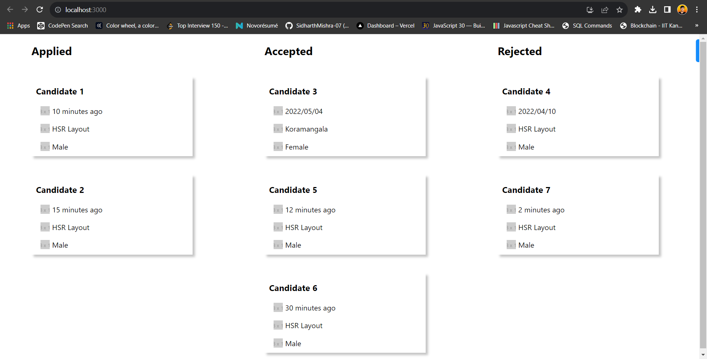

# React Work India Task (SDE Frontend)

## Introduction

This project was created as part of a task for Work India. It's a simple web application built using React that displays boxes by fetching data from the given API

## Technologies Used

- *React:* This project is built using React, a popular JavaScript library for building user interfaces.

## Implementation Details

- The boxes are created using React components and styled using CSS.
- Flexbox is used to arrange the boxes in a grid layout, making the layout responsive and easy to customize.
- The number of cards in each section of Applied, Accepted and Rejected is dynamically rendered via fetching data from API

## Screenshot of Website


### Installation
Open the terminal in the folder in which you wish to clone the repository and enter the following command:
``` 
git clone https://github.com/SidharthMishra-07/task.git
cd task
```
Install all the NPM packages:
```
npm i
```
In order to run the frontend:
```
npm run start
```